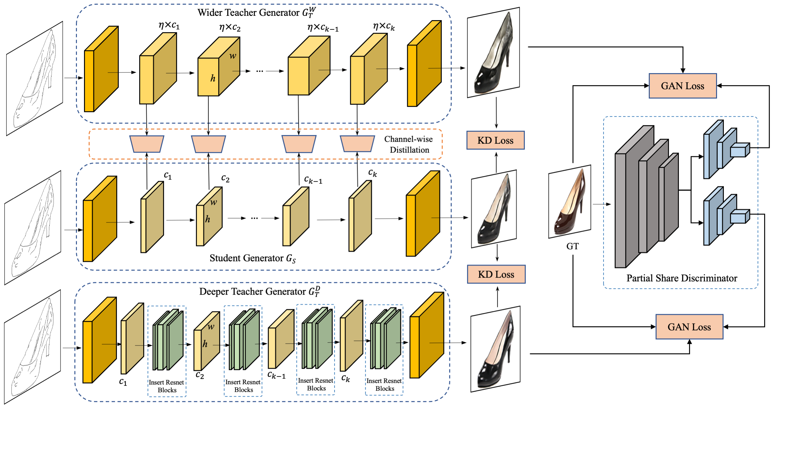

# Online Multi-Granularity Distillation for GAN Compression (ICCV2021)

This repository contains the pytorch codes and trained models described in the ICCV2021 paper "Online Multi-Granularity Distillation for GAN Compression" By Yuxi Ren*, Jie Wu*, Xuefeng Xiao, Jianchao Yang.
## Overview



## Performance


## Prerequisites

* Linux
* Python 3
* CPU or NVIDIA GPU + CUDA CuDNN

## Getting Started

### Installation

- Clone this repo:

  ```shell
  https://github.com/bytedance/Online-Multi-Granularity-Distillation-for-GAN-Compression.git
  cd Online-Multi-Granularity-Distillation-for-GAN-Compression
  ```

- Install dependencies.

  ```shell
  conda create -n OMGD python=3.7
  conda activate OMGD
  pip install torch==1.7.0 torchvision==0.8.0 torchaudio==0.7.0 
  pip install -r requirements.txt 
  ```

### Data preparation

- edges2shoes
- cityscapes
- horse2zebra
- summer2winter


### Training

- pretrained vgg16
  we should prepare weights of a vgg16 to calculate the style loss 
  
- train student model using OMGD
  Run the following script to train a unet-style student on cityscapes dataset, 
  all scripts for cyclegan and pix2pix on horse2zebra,summer2winter,edges2shoes and cityscapes can be found in ./scripts

  ```shell
  bash scripts/unet_pix2pix/cityscapes/distill.sh
  ```

### Testing

- test student models, FID or mIoU will be calculated, take unet-style generator on cityscapes dataset as an example

  ```shell
  bash scripts/unet_pix2pix/cityscapes/test.sh
  ```

## Citation

If you use this code for your research, please cite our paper.

## Acknowledgements

Our code is developed based on [GAN Compression](https://github.com/mit-han-lab/gan-compression)
